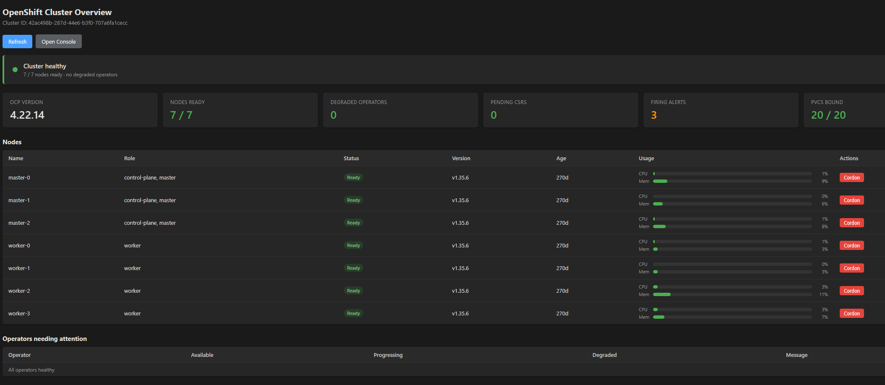
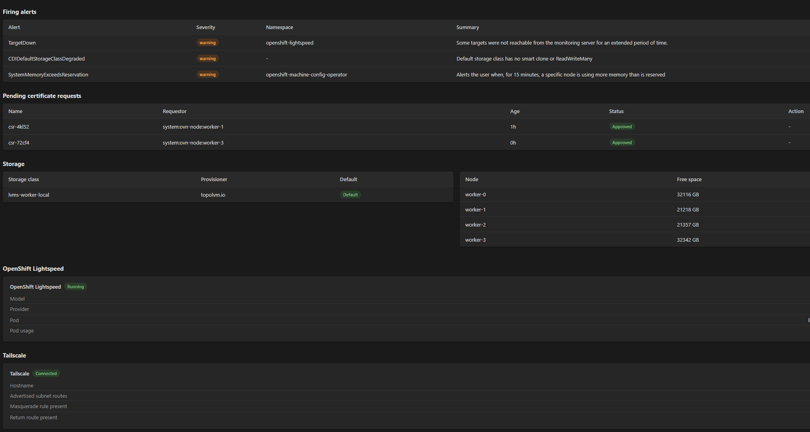

# cockpit-openshift-overview

A [Cockpit](https://cockpit-project.org/) plugin that gives you a single-page,
at-a-glance view of an OpenShift cluster — node readiness and resource usage,
operator health, firing alerts, pending CSRs with one-click approve, storage
classes, OpenShift Lightspeed model info, and Tailscale subnet-router checks.

## Features

- **Cluster health hero** — green if all nodes are ready and no operators are
  degraded, red otherwise.
- **Nodes** — Ready/NotReady status, roles, kubelet version, age, CPU/memory
  bars, cordon/uncordon buttons.
- **Operators needing attention** — anything Degraded, Progressing, or not
  Available.
- **Firing alerts** — pulled from Prometheus, Watchdog filtered out.
- **Pending CSRs** — per-row and bulk approve.
- **Storage** — storage classes and per-node free space from TopoLVM
  annotations.
- **OpenShift Lightspeed** — model and provider from OLSConfig, running state
  from the pod.
- **Tailscale** — advertised subnet routes, masquerade rule, return route.
- **Panel visibility menu** — a three-dot button lets you show or hide sections;
  choices persist across sessions.
- **Auto-hide** — Lightspeed and Tailscale hide themselves when their backends
  aren't present, and reappear automatically once they are.
- **Auto-refresh** — every 15 seconds while the tab is visible; pauses when
  the tab is hidden.

## Requirements

- Cockpit 286 or later
- `oc` CLI on the host, configured for the target cluster

## Install

    mkdir -p ~/.local/share/cockpit/openshift-overview
    cp manifest.json index.html app.js style.css \
       ~/.local/share/cockpit/openshift-overview/

Reload Cockpit (**Ctrl+Shift+R**) after installing.

For a system-wide install:

    sudo make install

## Kubeconfig

The plugin runs `oc` from a minimal environment that doesn't inherit your
shell's `KUBECONFIG`. It looks for the kubeconfig in this order:

1. `~/.config/cockpit-openshift-overview/kubeconfig` — if this file exists,
   its contents are used as the path to the kubeconfig.
2. `~/.kube/config`
3. `~/install-dir/auth/kubeconfig`
4. `~/.config/kube/config`
5. `/etc/kubernetes/admin.conf`

To point it somewhere else:

    mkdir -p ~/.config/cockpit-openshift-overview
    echo /path/to/your/kubeconfig > ~/.config/cockpit-openshift-overview/kubeconfig

To see which path was picked, open the browser dev console (F12) and look
for a line beginning with `[kubeconfig]`.

## Panel visibility

Use the three-dot button in the top-right of the toolbar to show or hide
panels. Your choices are saved to:

    ~/.config/cockpit-openshift-overview/config.json

The OpenShift Lightspeed and Tailscale panels auto-hide when their backends
aren't present on the host, and reappear automatically once they are.

## Uninstall

    rm -rf ~/.local/share/cockpit/openshift-overview
    rm -rf ~/.config/cockpit-openshift-overview

If you installed system-wide:

    sudo rm -rf /usr/local/share/cockpit/openshift-overview

## Development

Clone the repo and symlink it into your Cockpit directory so edits are
picked up on reload:

    git clone https://github.com/samjage/cockpit-openshift-overview.git
    cd cockpit-openshift-overview
    ln -s "$(pwd)" ~/.local/share/cockpit/openshift-overview

Cockpit doesn't cache packages in `~/.local/share/cockpit/`, so a browser
reload after each edit is enough.

## Contributing

Issues and pull requests are welcome. When reporting a bug, please include:

- Your Cockpit version (`cockpit-bridge --version`)
- Your OpenShift version (`oc get clusterversion`)
- The browser console output (F12 → Console)

## License

MIT — see [LICENSE](LICENSE).

## Author

Sam Jage — [github.com/samjage](https://github.com/samjage)
